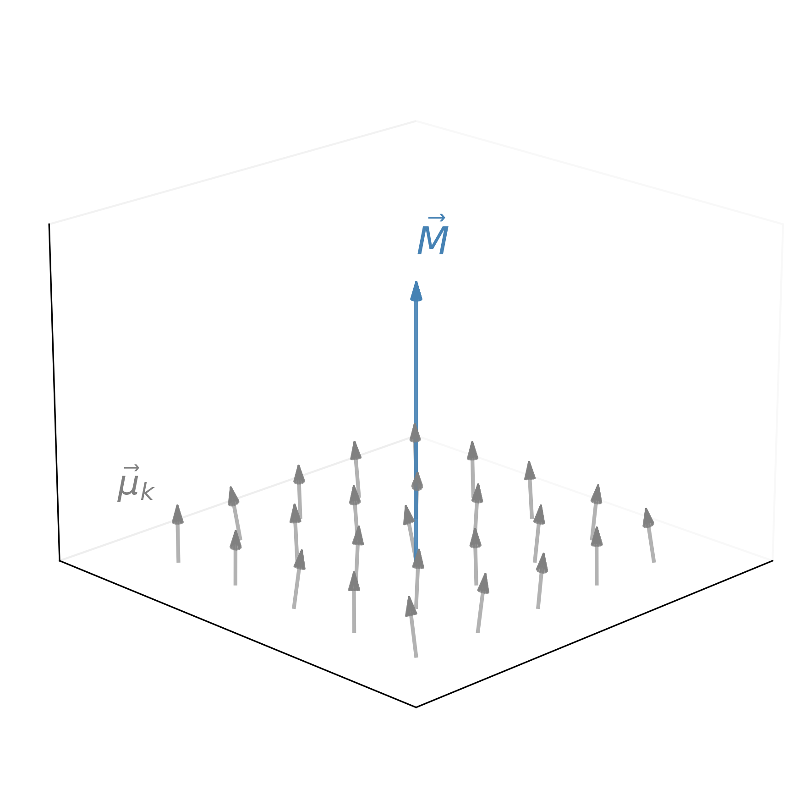
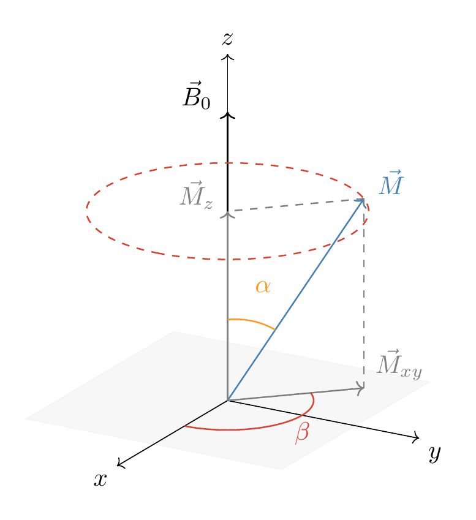
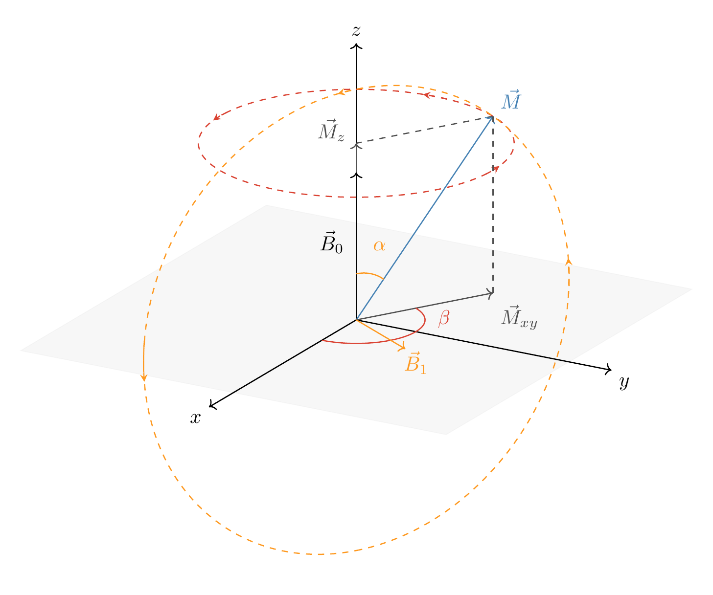
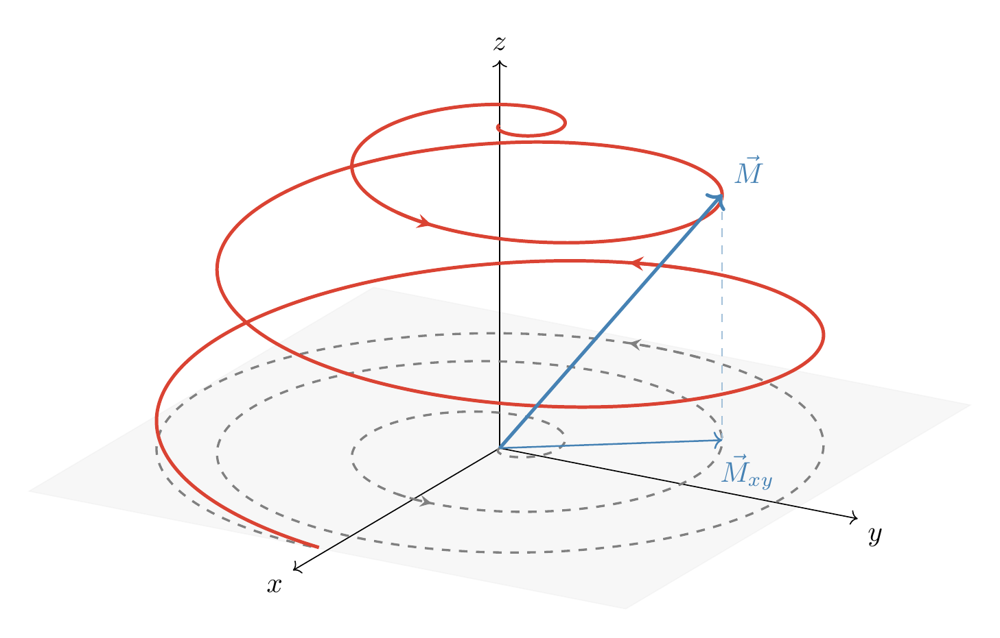
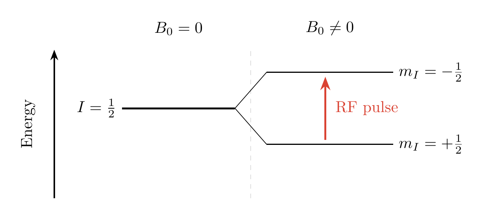
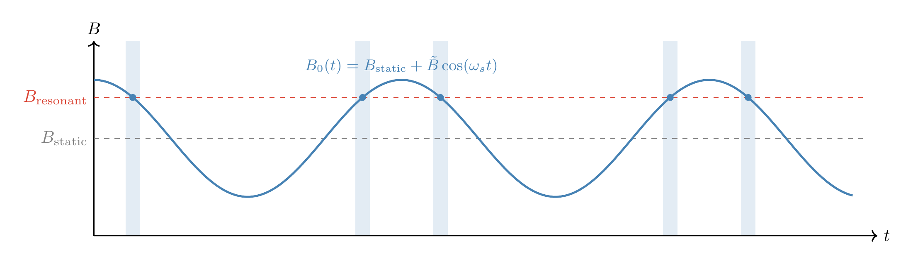
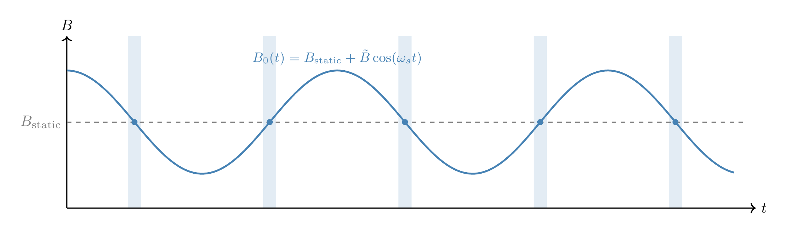

# Nuclear Magnetic Resonance

**Antoni Gonzalez and Spandan Suthar**
Quantum Physics Lab II • 341 Winter 2026

---

## $\rightarrow$ Applications of NMR

## Theoretical Background

## Experiment Setup

## Procedure

## Results

## Questions

---

## Applications of NMR

- Molecular structure investigation
  - Functional groups
  - Protein folding/unfolding studies
  - Polymer structure
- Substance identification
- Non-invasive medical imaging

---

## ~~Applications of NMR~~

## $\rightarrow$ Theoretical Background

## Experiment Setup

## Procedure

## Results

## Questions

---

## Magnetization as an Ensemble Average

<!--
Don't forget to say that we have
an ensemble of nuclear magnetic dipoles, first.
-->

$$
\hat M = \frac{1}{V} \left \langle {\sum_k  \hat \mu_k} \right \rangle
$$

 

$$
\braket{\hat M} = \vec M
$$

---

## Precession of $\vec M$

Magnetic dipoles precess around constant-direction magnetic fields $\vec B_0$.

Precession angle evolves at Larmor frequency:

$$\omega_\beta \equiv \dot \beta = \frac{g \mu_N B_0}{2\pi \hbar }$$

---

## RF-Induced Energy Transfer

Apply $\vec B_1$, static in the precession frame.

<!-- Static <-> resonance condition -->

Resonance: $\omega_{\text{rf}} = \omega_\beta$.

Orthogonal precession, at Larmor frequency:

$$
\omega_\alpha \equiv \dot \alpha = \frac{g \mu_B B_1}{ \hbar}
$$

---

---

## Zeeman Splitting and Resonance

Zeeman energy splitting lifts degeneracy:

$$
E = E_0 - \gamma \hbar B_0 m_I
$$

 

$\vec \mu \propto \vec I$, so TFAE:

- More negative $M_z$
- More negative $I_z$
- More negative $m_I$

<!--

What I want to emphasize is that the classical precession picture and the quantum transition picture are consistent.

When the RF pulse causes $\vec M$ to tilt toward the transverse plane, it decreases $M_z$, meaning a decrease in $I_z$, meaning a more negative magnetic quantum number.

RF pulses cause Zeeman transitions across the ensemble.

-->

---

## The Resonance Condition

The energy shift provided by the RF signal must meet the $\Delta m_I = -1$ energy spacing exactly.

$$
E_\text{rf} = E_\text{Zeeman}
$$

$$
\downarrow
$$

$$
\boxed{h \nu_\text{rf} = g \mu_N B_0 m_I}
$$

 

> Goal: plot $h \nu_\text{rf} \space$ vs $\space \mu_N B_0 m_I$. Recover $g$ through slopes of regression lines.

---

## Sweeping $\vec B_0$ vs. Pulsing RF

<!--
We need to meet the resonance condition for short windows of time.

This allows us to clearly see when resonance is met and to produce clear, well-spaced resonance structures that allow us to measure the time taken for the ensemble to relax from the its higher-energy state.

How do we do that?
-->

Short periods of nutation are created by meeting the resonance condition for short intervals.

- Allow slow sinusoidal modulation in $\vec B_0$
  - $B_0(t) = B_\text{static} + \tilde B \cos(\omega_s t)$
- Find $\nu_\text{rf}$ at which $\omega_\text{rf}$ is near $\omega_0$
  - Resonance windows
- Equally-space resonance windows (experimental convenience)

---

## Sweeping $\vec B_0$ vs. Pulsing RF

---

## Sweeping $\vec B_0$ vs. Pulsing RF

## 

---

## ~~Applications of NMR~~

## ~~Theoretical Background~~

## $\rightarrow$ Experiment Setup

## Procedure

## Results

## Questions

---
