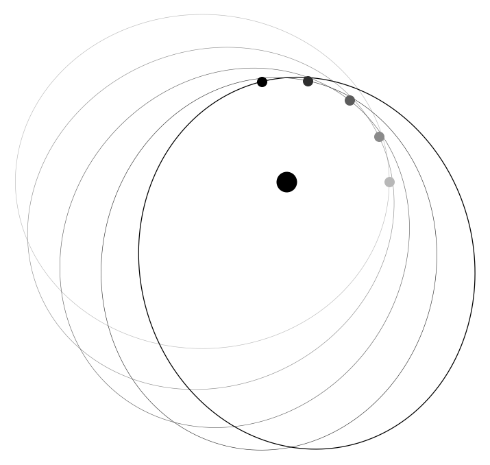
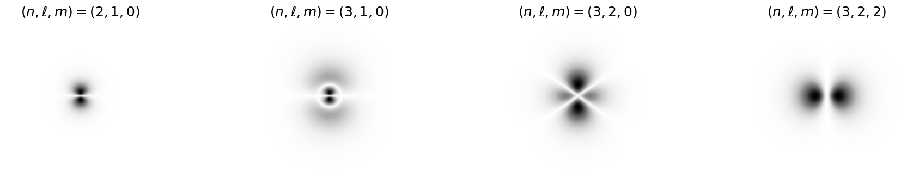
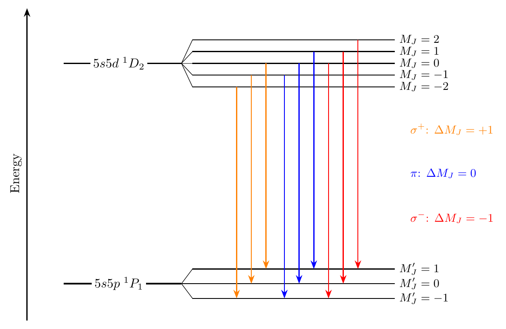
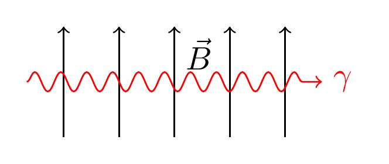
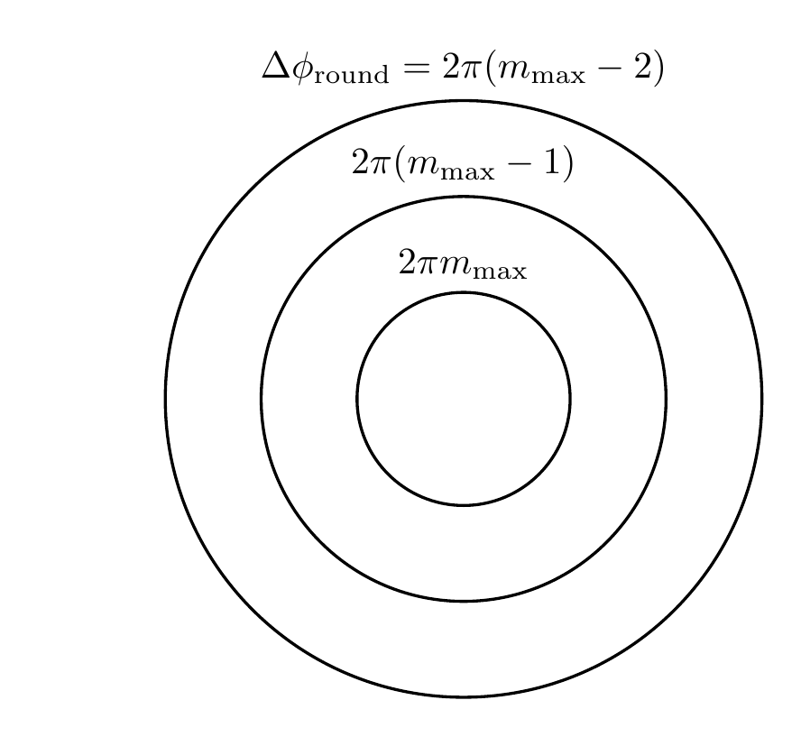
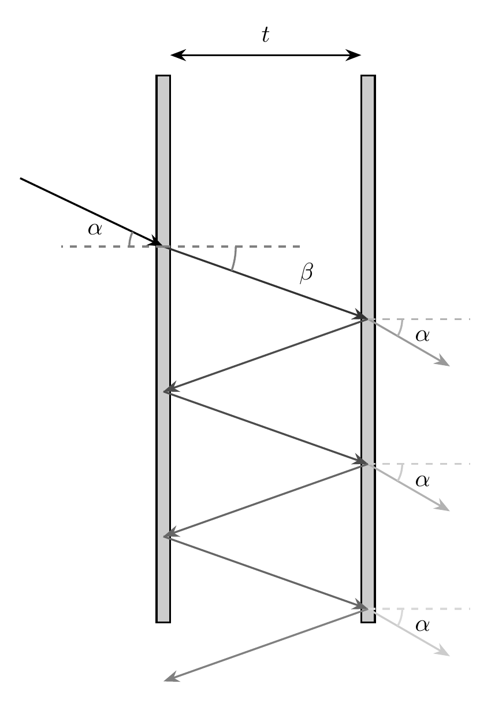
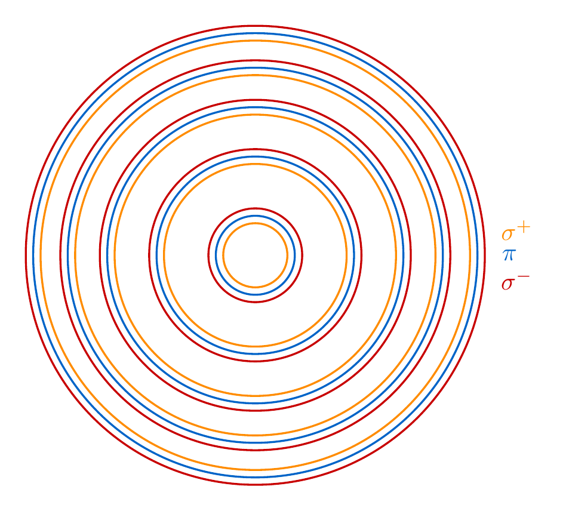
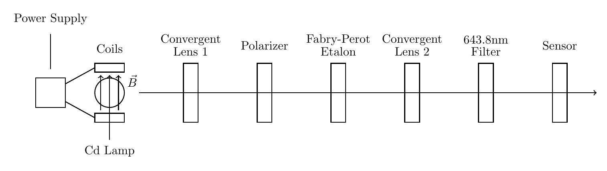
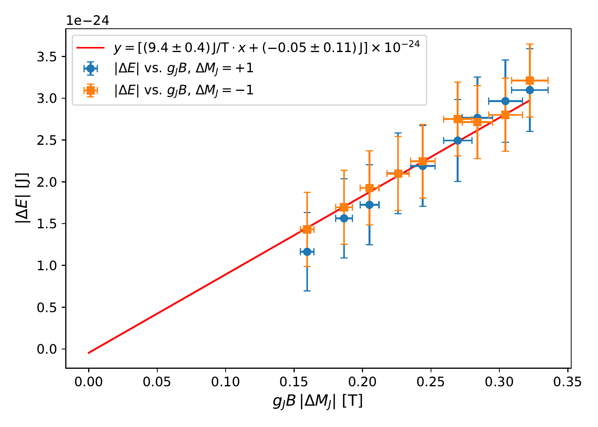
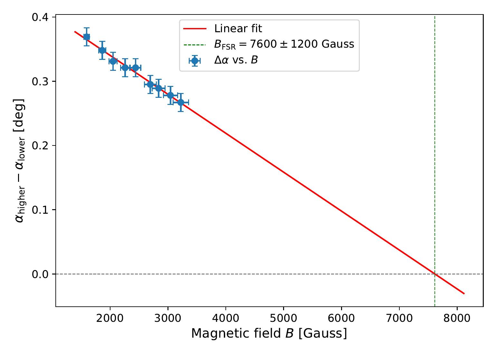

<!-- _class: title -->

# Verification of Zeeman Effect Theory

## via a Fabry-Pérot Interferometer

 
 

**Spandan Suthar**
PHYS 341, Winter 2026

---

# Mercury's Perihelion Precession

 
 

**Mercury's orbital precession** comes from other planets' gravitational pulls.

> Two-body Kepler problems are exactly solvable. 3-body and $n$-body problems exhibit chaos.

 

**Perturbation theory:**

1. Solve the unperturbed problem first.
2. Add small terms to the Hamiltonian.
3. Observe new, complex behaviors.

---

# From Planets to Magnetic Fields

$$H = H_{\text{Kepler}} - \boxed{\sum_i \frac{Gmm_i}{|\vec{r} - \vec{r}_i|}}$$

$$\hat{H} = \hat{H}_0 - \boxed{\hat{\boldsymbol{\mu}} \cdot \mathbf{B}}$$

Classical: Mercury

- System: Kepler orbit around the Sun
- Perturbation: Gravitational pull of other planets
- Effect: Perihelion (closest approach) precession

Quantum: Cadmium Potential Well

- System: Energy levels of a cadmium atom
- Perturbation: Weak magnetic field $\vec{B}$
- Effect: Degeneracy splitting (Zeeman effect)

---

# Quantum Numbers and Atomic States

 

| Quantum number           | Symbol | Operator             | Range                             |
| ------------------------ | ------ | -------------------- | --------------------------------- |
| Spin                     | $S$    | $\hat{\mathbf{S}}^2$ | $0,\, \tfrac{1}{2},\, 1,\, \dots$ |
| Orbital angular momentum | $L$    | $\hat{\mathbf{L}}^2$ | $0,\, 1,\, 2,\, \dots$            |
| Total angular momentum   | $J$    | $\hat{\mathbf{J}}^2$ | $\|L - S\|,\, \dots,\, L + S$     |
| Magnetic                 | $M_J$  | $\hat{J}_z$          | $-J,\, \dots,\, J$                |

 

---

# Selection Rules

$$(\gamma, L, S, J, M_J) \;\xrightarrow{\pm \text{ photon}}\; (\gamma', L', S, J', M_J')$$

 

|     | Operator             | Rule                                                  |
| --- | -------------------- | ----------------------------------------------------- |
| 1   | $\hat{\mathbf{S}}^2$ | $\Delta S = 0$                                        |
| 2   | $\hat{\mathbf{L}}^2$ | $\Delta L = \pm 1$                                    |
| 3   | $\hat{\mathbf{J}}^2$ | $\Delta J = 0, \pm 1$ $\;(J=0 \nleftrightarrow J'=0)$ |
| 4   | $\hat{J}_z$          | $\Delta M_J = 0, \pm 1$                               |
| 5   | $\hat{\Pi}$ (parity) | $\Pi' = -\Pi$                                         |

---

# The Zeeman Effect

 
 

$\vec{B} = 0$:

States with different $M_J$ values are degenerate
 
$\vec{B} \neq 0$:

Degeneracy is lifted → distinct energy levels

 

---

# Photon Emission and Polarization

 
 
 

Photon emission satisfies angular momentum conservation.

$\Delta J_z ^{\text{atom}} + J_z ^{(\gamma)} = 0$

- $\sigma^\pm: J_z^{(\gamma)} = \mp \hbar \space \space \space (\perp \vec B)$
- $\pi: J_z^{(\gamma)} = 0$ $\space \space \space (\parallel \vec B)$
- A polarizer with orientations $\in \set{\perp, \parallel}$ selects split vs. unsplit photons

> Circularly polarized along $\vec B$ $\leftrightarrow$ Linearly polarized transverse to $\vec B$

---

<!-- _class: roadmap -->

## ~~Zeeman Effect Theory~~

## → Optics Theory

## Procedure

## Results

---

# The Fabry-Pérot Etalon

$$\phi_\text{round}(\beta) = 2 \left ( \frac{2\pi n}{\lambda} \right ) t\cos\beta = 2\pi m$$

---

# Zeeman-Split Interference Pattern

$$\Delta E = \mu_B g_J B M_J = -\frac{hc}{\lambda} \frac{\cos \beta_f - \cos \beta_0}{\cos \beta_0}$$

 

$0$: Unsplit state
$f$: Split state

 

> Upward photon energy shifts $\leftrightarrow$ larger radii

---

<!-- _class: roadmap -->

## ~~Zeeman Theory~~

## ~~Optics Theory~~

## → Procedure

## Results

---

# Apparatus

---

# Procedure

 

> Indirectly measure a precisely known physical constant: $\mu_B$.

- Alignment along optical rail
- Record $(\alpha_-, \alpha_0, \alpha_+)^{(i)}$ values at varying field strengths $B^{(i)}$
- Fit energy-angle eq.
  - $\mu_B g_J B M_J = -\frac{hc}{\lambda} \frac{\cos \beta_f - \cos \beta_0}{\cos \beta_0}$
- Obtain an experimental value for $\mu_B$

---

<!-- _class: roadmap -->

## ~~Zeeman Theory~~

## ~~Optics Theory~~

## ~~Procedure~~

## → Results

---

# Free Spectral Range

> The field $B_\text{FSR}$ at which $\sigma^\pm$ lines from adjacent rings coincide helps estimate systematic error in $B$.

- $\text{FSR} = \frac{c}{2nt}$
- $B_\text{FSR} = \frac{h}{\mu_B} \frac{c}{2nt} \frac{1}{g_J |\Delta M_J|}$

 

|                    | Experimental     | Theoretical |
| ------------------ | ---------------- | ----------- |
| $B_\text{FSR}$ (G) | $15200 \pm 2400$ | $18300$     |

 

$1.3\sigma$ discrepancy — low to moderate systematic error in $B$.

---

# Results

|               | Experimental                    | Accepted                |
| ------------- | ------------------------------- | ----------------------- |
| $\mu_B$ (J/T) | $(9.4 \pm 0.4) \times 10^{-24}$ | $9.274 \times 10^{-24}$ |

 

## Takeways

- $\mu_B$ is recovered to within $0.23\sigma$ of the accepted value.
- We place greater trust in the perturbative analysis of Zeeman energy splitting.
- Selection rules are verified with clean split-unsplit patterns separation via polarizer.
- Systematic error in $\vec B$ $\rightarrow$ deviations of $\mu_B$ from accepted.
